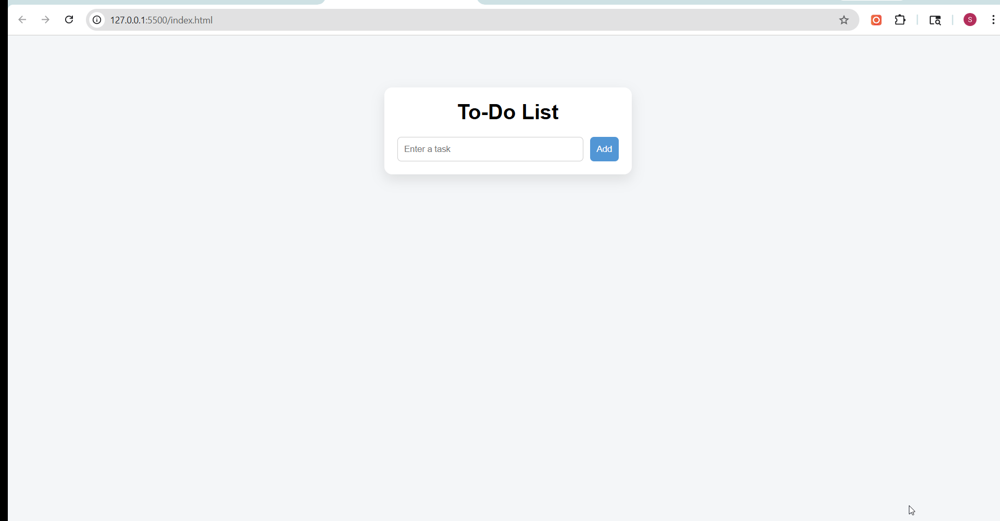

# Task 1: Interactive To-Do List Application

## Objective
To build an interactive to-do list application using JavaScript that allows users to add, edit, complete, and delete tasks.

## Features Implemented
- Add new tasks using input field and button
- Add tasks using the Enter key
- Mark tasks as complete using a dedicated button
- Edit tasks dynamically and save changes
- Delete tasks from the list
- Interactive UI with hover effects and smooth transitions

## Technologies Used
- HTML5
- CSS3
- JavaScript (DOM Manipulation, Event Handling)

---

## Implementation Details

### DOM Manipulation
- Used `document.createElement()` to dynamically create task elements
- Appended elements to the DOM using `appendChild()`
- Updated and removed elements dynamically

### Event Handling
- Added event listeners for:
  - Adding tasks (`click`, `keypress`)
  - Completing tasks (`click`)
  - Editing tasks (`click`)
  - Deleting tasks (`click`)

### Task Actions

#### Add Task
- Retrieves input value
- Creates a new list item dynamically

#### Complete Task
- Toggles a CSS class (`completed`) using:
- ```javascript
- element.classList.toggle("completed");

### Edit Task
- Replaces text with an input field
- Allows user to modify and save the task

### Delete Task
- Removes the task element using:
- element.remove();

### UI Enhancements
- Hover scaling effect on task items
- Color-coded action buttons (complete, edit, delete)
- Clean card-style layout with shadows and spacing

### Output
