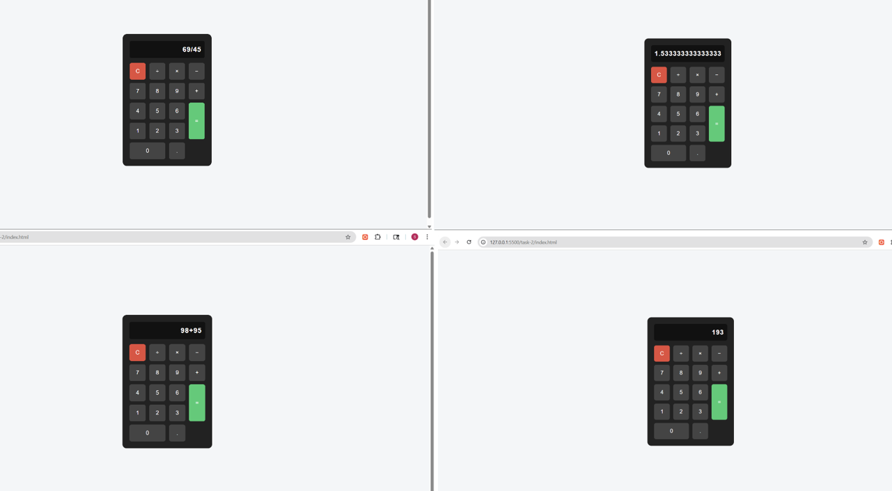

# Task 2: Simple Calculator

## Objective
To build a basic calculator using JavaScript that performs arithmetic operations such as addition, subtraction, multiplication, and division.

## Features Implemented
- Numeric and operator buttons for user input
- Dynamic display updates as user interacts
- Basic arithmetic operations (+, −, ×, ÷)
- Clear button to reset the display
- Error handling for invalid expressions
- Clean and interactive UI design

## Technologies Used
- HTML5
- CSS3
- JavaScript (DOM Manipulation, Event Handling)

---

## Implementation Details

### Input Handling
- Button clicks trigger JavaScript functions using `onclick`
- Values are appended to the display dynamically

### Example:
- ```javascript
- function append(value) {
-    display.value += value;}

### Output:
