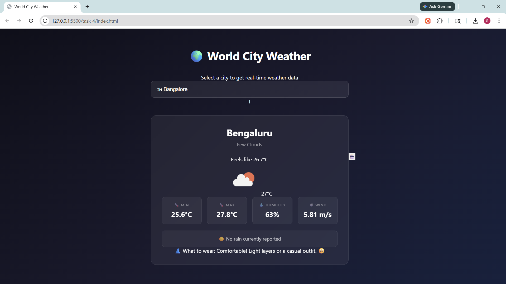
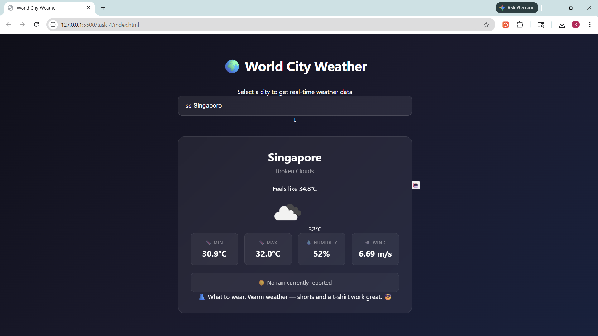

# Weather App with API Integration

A responsive weather web app that fetches real-time weather data for top world cities using the OpenWeatherMap API. Built with HTML, CSS, and vanilla JavaScript.

## Features

- 🌍 Dropdown with top world cities including Bangalore
- 🌡️ Displays min/max temperature, humidity, wind speed, and feels like
- 🌧️ Rain prediction and current weather conditions
- 👗 Outfit and travel suggestions based on live weather
- 🤖 Floating chatbot that answers weather queries, compares two cities, and gives travel tips
- ❌ Error handling for invalid cities and failed network requests

## Tech Stack

- HTML5
- CSS3 (Flexbox, Grid, Animations)
- Vanilla JavaScript (Fetch API, Async/Await, DOM Manipulation)
- OpenWeatherMap API

## Demo




## API Used

- [OpenWeatherMap](https://openweathermap.org/api) — Current Weather Data endpoint
```
  https://api.openweathermap.org/data/2.5/weather?q={city}&appid={key}&units=metric
```