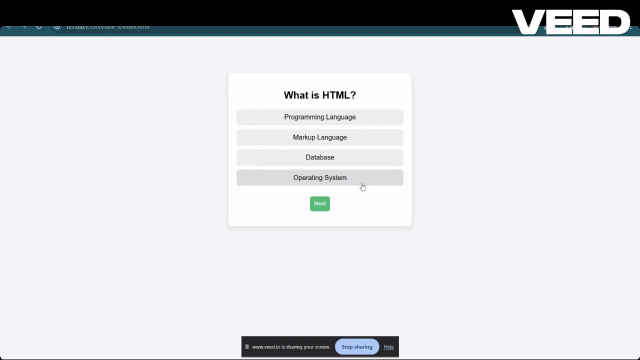

# Task 5: Dynamic Quiz Application

## Objective
To build a dynamic quiz application using JavaScript that loads questions, captures user responses, and calculates the final score.

## Features Implemented
- Dynamically loaded quiz questions from a JavaScript array
- Multiple choice options for each question
- Option selection with visual highlighting
- Navigation through questions using a Next button
- Score tracking based on correct answers
- Final result display after completing the quiz
- Clean and responsive user interface

## Technologies Used
- HTML5
- CSS3
- JavaScript (DOM Manipulation, Event Handling, State Management)

---

## Implementation Details

### Data Structure
- Quiz questions are stored in a JavaScript array of objects
- Each object contains:
  - Question text
  - Options array
  - Correct answer index

### State Management
- Used variables to track:
  - Current question index
  - User score
  - Selected option

### Dynamic Rendering
- Questions and options are rendered dynamically using DOM manipulation
- Cleared and reloaded content for each new question

### Event Handling
- Added click event listeners to:
  - Select an option
  - Move to the next question
- Used class toggling to highlight selected options

### Score Calculation
- Compared selected option with correct answer
- Incremented score accordingly

### Result Display
- Displayed final score after last question
- Hid quiz elements and showed result message

---

## UI Enhancements
- Highlight selected answer
- Hover effects on options
- Centered card layout with clean spacing
- Smooth user interaction flow

---

## Output

### Quiz Application Demo
