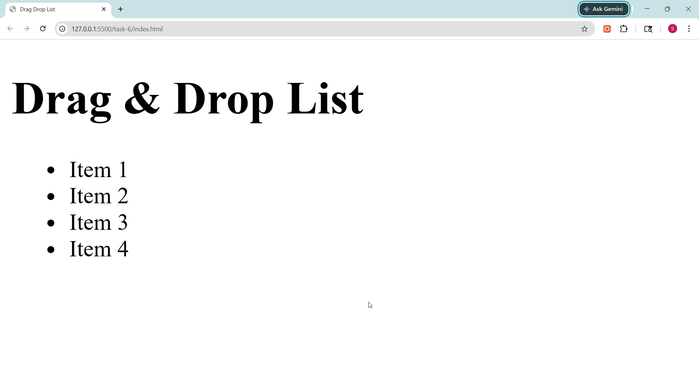

# Task 6: Drag and Drop List Reordering

## Objective
To implement a list that allows users to reorder items using drag and drop functionality with the HTML5 Drag and Drop API.

## Features Implemented
- Draggable list items using HTML5 Drag and Drop API
- Reordering of items by dragging and dropping
- Visual feedback during drag operations
- Highlighting of potential drop targets
- Smooth and interactive user experience

## Technologies Used
- HTML5
- CSS3
- JavaScript (DOM Manipulation, Drag and Drop API)

---

## Implementation Details

### Drag and Drop API
- Used built-in HTML5 drag events:
  - dragstart
  - dragover
  - dragleave
  - drop
  - dragend

### Drag Handling
- Stored the currently dragged item in a variable
- Added a visual style to indicate the dragging state

### Drop Handling
- Used `event.preventDefault()` in dragover to allow dropping
- Swapped content between dragged item and drop target

### Visual Feedback
- Added CSS classes to:
  - Highlight the dragged item
  - Indicate valid drop targets

### DOM Updates
- Updated list item content dynamically to reflect new order after drop

---

## UI Enhancements
- Hover and drag visual effects
- Highlighted drop zones for better usability
- Clean and minimal list design

---

## Output

### Drag and Drop Demo
