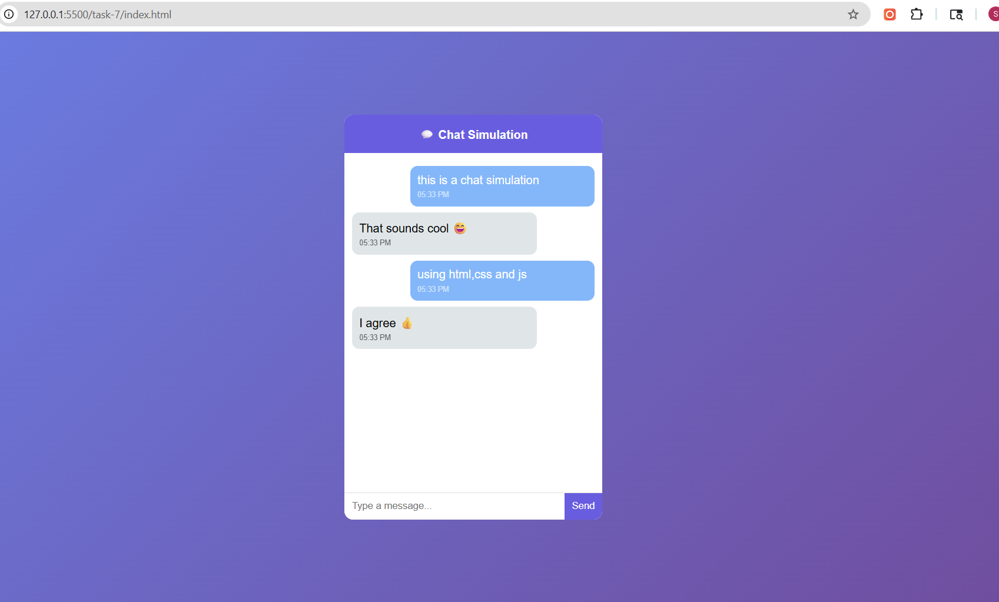

# Task 7: Real-time Chat Simulation

## Objective
To develop a chat interface that simulates real-time messaging using JavaScript without a backend.

## Features Implemented
- Chat interface with message display window
- User message input and send functionality
- Simulated incoming messages using timed responses
- Dynamic message rendering with timestamps
- Auto-scrolling chat window
- Responsive and colorful UI design
- Smooth message animations

## Technologies Used
- HTML5
- CSS3
- JavaScript (DOM Manipulation, Event Handling, Timers)

---

## Implementation Details

### Message Handling
- Captured user input and displayed messages dynamically
- Created message elements using JavaScript and appended them to the chat container

### Simulated Responses
- Used setTimeout to generate delayed bot replies
- Random responses selected from a predefined array

### Timestamp Feature
- Generated timestamps using JavaScript Date object
- Displayed time for each message

### Event Handling
- Added event listeners for:
  - Send button click
  - Enter key press

### Auto Scroll
- Ensured the chat window scrolls to the latest message automatically

---

## UI Enhancements
- Colorful gradient background
- Distinct styles for user and bot messages
- Smooth fade-in animation for messages
- Rounded chat bubbles with clean spacing
- Fully responsive layout for smaller screens

---

## Output

### Chat Simulation Demo
