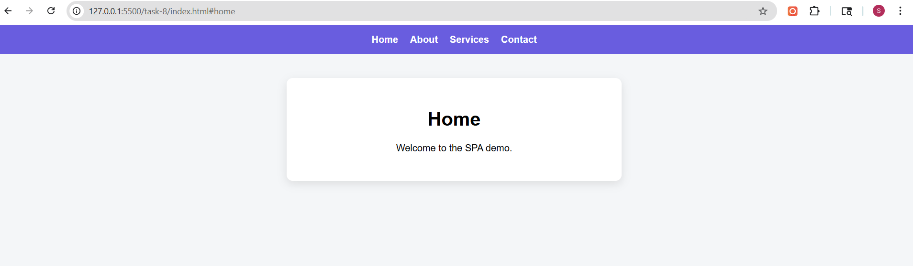
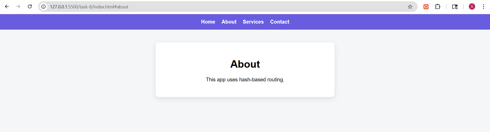
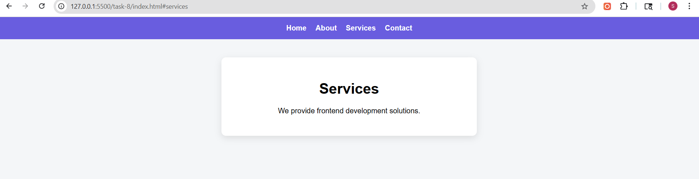
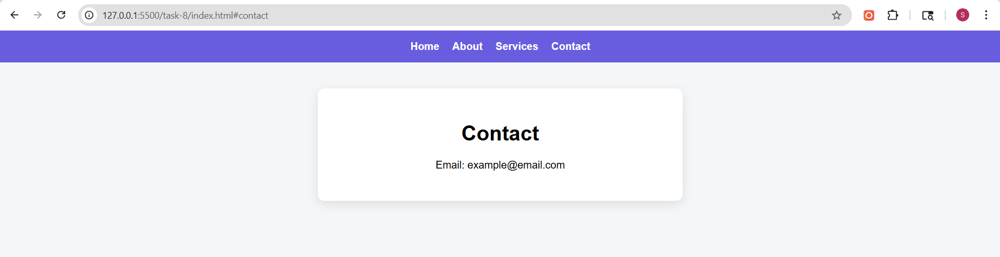

# Task 8: Single-Page Application (SPA) with Hash-based Routing

## Objective
To build a basic Single-Page Application (SPA) that navigates between different views without reloading the page using hash-based routing.

## Features Implemented
- Navigation between multiple views (Home, About, Services, Contact)
- Hash-based routing using URL fragments
- Dynamic content rendering without page reload
- Smooth transitions between views
- Consistent UI layout across all routes
- Responsive and clean design

## Technologies Used
- HTML5
- CSS3
- JavaScript (DOM Manipulation, Event Handling, Routing)

---

## Implementation Details

### Hash-based Routing
- Used URL hash (`#home`, `#about`, etc.) to represent different routes
- Listened to route changes using `window.onhashchange`

### Dynamic Rendering
- Stored page content in a JavaScript object (routes)
- Updated the DOM dynamically using `innerHTML` based on current route

### Route Handling
- Extracted current route using `window.location.hash`
- Defaulted to Home page if no hash is present

### Event Handling
- Used event listeners to detect hash changes and trigger re-rendering

### UI Consistency
- Maintained a fixed navigation bar
- Updated only the content section for each route

---

## UI Enhancements
- Smooth fade-in animation during page transitions
- Centered card-style layout for content
- Responsive design for smaller screens
- Clean and minimal navigation bar

---

## Output

### Home View

### About View

### Services View

### Contact View
